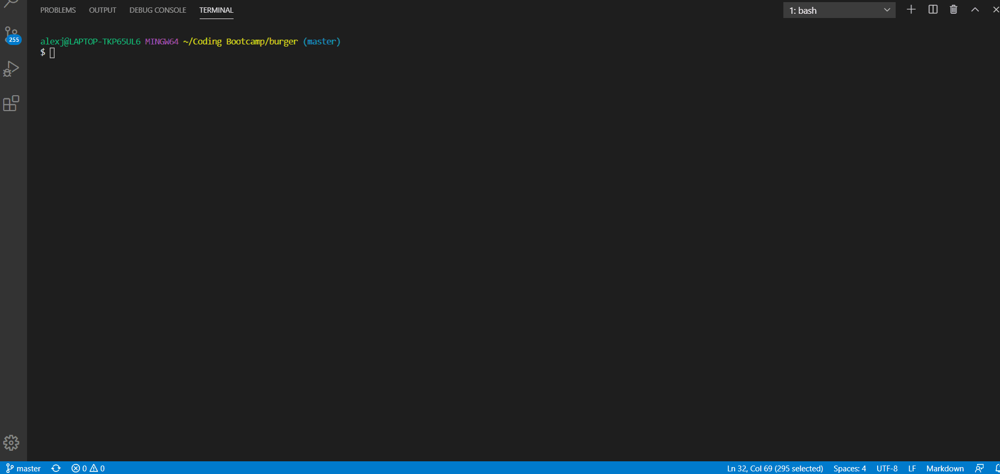
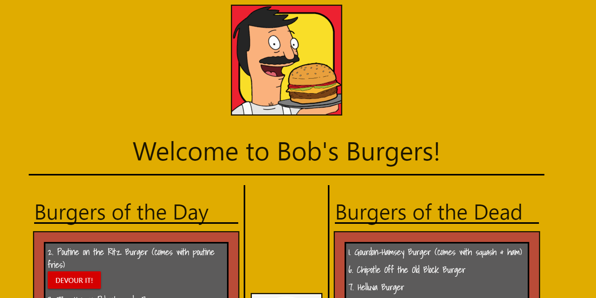
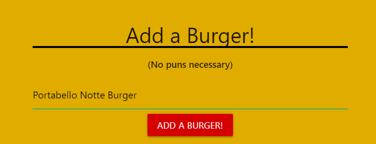

# burger
This application demonstrates the use of ORM and Handlebars to generate a burger logger.

## Description
The project takes user-inputted information and stores the data in a mysql database, which in turn displays the data on the front-end. The user can also modify a value from the database and the new data will be instantly rendered on the page.

### Table of Contents
I. Title
II. Description
III. Table of Contents
IV. Installation
V. Visuals
VI. Usage
VII. License
VIII. Contributing
IX. Test(s)
X. Questions
    
## Installation
The user will need to install MySQL, Express, and Express-Handlebars to run the application locally.

## Visuals

GIF
 

IMAGES
 

    
## Usage
Upon loading the application, the user will be presented with burgers on the left, each with a "devour" button. Upon clicking the respective button, the burger will have been "devoured" and will move to the right side of the screen. The user may also add as many burgers as they want utilizing the input form at the bottom of the screen.

## License

    
## Contributing
N/A

## Test(s)
There are no tests at this time.

## Questions
If you have any questions, please feel free to contact me below.
Email: Not Provided
<a href='https://github.com/alexjoeldelgado'>Github Profile: alexjoeldelgado</a>

